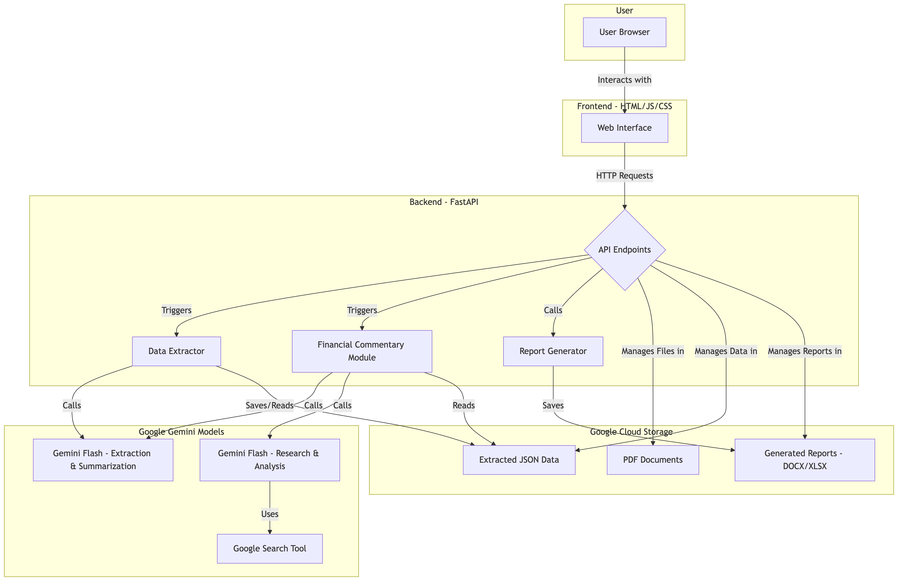
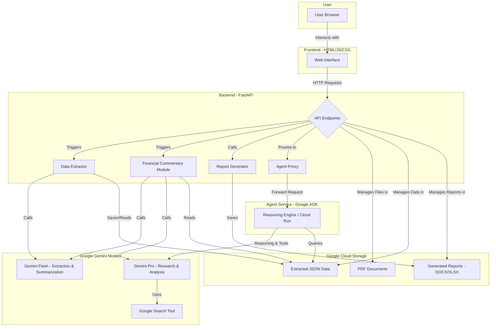

# Architecture Document

## 1. Overview

### High-Level Architecture Diagram

This document outlines the architecture of the Credit Assessment Memo application, a web-based tool designed to streamline the process of credit analysis. The application allows users to upload financial documents (in PDF format), extracts relevant data, stores it, and generates comprehensive analysis reports, including financial spreadsheets and credit memos.
The system is built on a modern technology stack, featuring a Python-based backend powered by the **FastAPI** framework, a vanilla **HTML, CSS, and JavaScript** frontend,  **Google Cloud Storage (GCS)** for robust and scalable data persistence and application's core intelligence is powered by **Google's Gemini** family of models. 

Click to view Mermaid Diagram Code

## 2. Backend Architecture (FastAPI)

The backend is a RESTful API built with FastAPI, chosen for its high performance, automatic interactive documentation, and modern Python features. It serves as the core engine of the application, handling business logic, data processing, and communication with the storage layer.

### Key Responsibilities:

*   **File Handling:** Manages the uploading and temporary storage of PDF documents.
*   **Data Extraction:** Orchestrates the process of parsing PDFs to extract structured financial data.
*   **Data Persistence:** Interfaces with Google Cloud Storage to save and retrieve all application data, including uploaded files, extracted data, and generated reports.
*   **Report Generation:** Triggers and manages the creation of Excel spreadsheets and Word-based credit memos.
*   **API Endpoints:** Exposes a set of endpoints for the frontend to consume.

### Core Modules:

*   `src/backend.py`: The main entry point of the FastAPI application. It defines all the API endpoints, handles request validation, and orchestrates the calls to other modules.
*   `src/data_extractor.py`: Contains the logic for extracting financial data from the uploaded PDF files.
*   `src/gcs_storage.py`: A dedicated module to manage all interactions with Google Cloud Storage. It abstracts the details of uploading, downloading, and listing files, providing a clean interface for the rest of the backend.
*   `src/financial_commentary.py`: Implements the business logic for generating comprehensive analyses and reports, including financial commentary, credit rating, risk policy, and industry analysis.
*   `src/update_excel.py`: Contains the logic for populating a template Excel file with the extracted financial data.

### API Endpoints:

The API is structured around a clear, resource-oriented design. Key endpoints include:

*   `POST /upload-pdf/`: Handles the upload of PDF files.
*   `POST /extract/`: Triggers the data extraction process from a previously uploaded PDF.
*   `GET /load-data/`: Retrieves extracted financial data for a specific company and year.
*   `POST /save-updated-data/`: Saves user-modified data back to GCS.
*   `POST /generate-and-download-spreadsheet/`: Generates and returns a financial spreadsheet.
*   `POST /generate-and-download-credit-memo/`: Generates and returns a credit memo document.
*   `GET /companies`: Lists all companies available in the system.
*   `DELETE /delete-company/{company_name}`: Deletes a company and all its associated data.

## 3. Frontend Architecture (HTML/JS/CSS)

The frontend is a client-side application built with vanilla HTML, CSS, and JavaScript. It provides a clean and intuitive user interface for interacting with the backend services.

### Structure:

The frontend is composed of several HTML pages, each serving a specific purpose:

*   `index.html`: The main dashboard and entry point of the application. It displays a list of all entities (companies) and provides the option to add new ones.
*   `new-entity.html`: A form for creating a new company and uploading its initial documents.
*   `entity.html`: A detailed view for a specific company, showing its data, analysis reports, and providing options to manage its documents and generate reports.
*   Analysis Pages (`summary.html`, etc.): Individual pages or templates to display different parts of the generated analysis.

### Key Scripts:

*   `script.js`: The main JavaScript file for `index.html`. It handles fetching the list of companies from the backend, rendering the company table, and managing the deletion of companies.
*   `entity.js`: The primary script for the `entity.html` page. It manages the logic for a single entity, including loading its data, handling document uploads, and initiating the generation of reports.
*   `new-entity.js`: Handles the form submission for creating a new entity.
*   `utils.js`: Contains utility functions shared across different parts of the frontend.

### Client-Server Interaction:

The frontend communicates with the backend exclusively through the REST API. It uses the standard `fetch` API to make asynchronous HTTP requests to the backend endpoints. All data is exchanged in JSON format.

## 4. Data Flow and Storage

The application's data flow is designed to be simple and robust, with Google Cloud Storage (GCS) serving as the single source of truth for all persistent data.

### Storage Strategy:

GCS is used to store the following:

*   **Uploaded Documents:** Original PDF files are stored in dedicated folders for each company.
*   **Extracted Data:** The structured data extracted from PDFs is saved as JSON files. This allows for easy retrieval and modification.
*   **Generated Reports:** Final reports, such as Excel spreadsheets (`.xlsx`) and credit memos (`.docx`), are stored in GCS before being served to the user for download.
*   **Company Metadata:** Basic information about each company (like name and industry) is stored in a metadata file.

### Typical Workflow:

1.  **Create Entity:** A user creates a new company entity through the `new-entity.html` page. The frontend calls `/create-company` to save metadata.
2.  **Upload Documents:** The user uploads financial documents (PDFs) for that company. The files are sent to the `/upload-classified-documents` endpoint and stored in structured GCS folders.
3.  **Data Extraction (Implicit):** The backend processes documents implicitly or via trigger. Data extraction logic is historically tied to `/extract` or `/extract_multi_year_data` for financial spreads.
4.  **View and Edit Data:** The user navigates to the `entity.html` page. The frontend calls `/load-all-data` to fetch extracted JSON data from GCS for display and editing.
5.  **Generate Reports (Modular Pipeline):**
    *   **Section Generation:** The user can regenerate specific sections (e.g., Financial Commentary, SWOT) via the `/generate-section/` endpoint.
    *   **Assembly:** To create the final CAM, the user triggers the `/assemble-memo/` endpoint.
    *   **Spreadsheet:** The user can separately trigger `/generate-and-download-spreadsheet/`.
    *   **Save Logic:** Updates to data are saved via `/save-updated-data/`.
6.  **View Analysis:** The user views generated HTML reports via the `/view-analysis` endpoint (e.g., `?type=industry`, `?type=swot`).

## 5. AI Integration (Google Gemini)

The application's core intelligence is powered by Google's Gemini family of models. Different models are leveraged for specific tasks, from initial data extraction to in-depth analysis, forming a sophisticated pipeline that automates much of the credit assessment process.

### 5.1. Data Extraction (`src/data_extractor.py`)

*   **Model Used:** Gemini 2.5 Flash (`gemini-2.5-flash`)
*   **Process:**
    1.  The `extract_financial_data` function is responsible for parsing financial documents (PDFs).
    2.  It provides the Gemini model with a detailed prompt (`simple_extraction.txt`) and a structured JSON schema (`fieldstoextract.json`) that defines the exact data points to be extracted.
    3.  The model processes the PDF content and returns a structured JSON object that strictly adheres to the provided schema. This ensures consistency and reliability of the extracted data.
    4.  The implementation includes robust error handling and a retry mechanism to manage potential API issues and ensure that the final output is always a valid JSON object.

### 5.2. Comprehensive Analysis (`src/financial_commentary.py`)

The `generate_memo` function orchestrates a **14-stage analysis pipeline** to generate a complete Credit Appraisal Memo (CAM). Each section is generated independently using specialized Gemini models and prompts.

| Section | Purpose | Data Sources | Prompt File | Model |
| :--- | :--- | :--- | :--- | :--- |
| **Borrower Profile** | Overview of the company's background and business model. | Annual Reports (PDF) | `borrower_profile.txt` | Gemini 2.5 Flash |
| **Financial Commentary** | Performance analysis, year-over-year trends, and key observations. | Extracted Financial Data (JSON) | `financial_commentary.txt` | Gemini 2.5 Flash |
| **Credit Rating** | Analysis of existing credit ratings and rationale. | Financial Reports (PDF) | `credit_rating.txt` | Gemini 2.5 Flash |
| **Risk Policy** | Assessment of adherence to internal risk policies. | Extracted Financial Data (JSON) | `risk_policy.txt` | Gemini 2.5 Flash |
| **Business Analysis** | Deep dive into business segments and operational performance. | Annual Reports (PDF) | `business_analysis.txt` | Gemini 2.5 Flash |
| **Industry Analysis** | External market research, trends, and competitive landscape. | Generated `business_analysis.md`, Google Search | `industry_analysis.txt` | Gemini 2.5 Pro |
| **Earnings Call** | Insights from management discussion and Q&A. | Earnings Call Audio Files | `earnings_call.txt` | Gemini 2.5 Flash |
| **Forensics** | Detection of red flags or accounting anomalies. | Annual Reports (PDF) | `forensics.txt` | Gemini 2.5 Flash |
| **SWOT Analysis** | Strategic analysis of Strengths, Weaknesses, Opportunities, Threats. | Annual Reports (PDF), `financial_commentary.md`, Google Search | `swot_analysis.txt` | Gemini 2.5 Flash |
| **Promoter Analysis** | Evaluation of promoter background and shareholding. | Annual Reports (PDF) | `promoter_analysis.txt` | Gemini 2.5 Flash |
| **Business Summary** | Executive summary of the business analysis. | Generated `business_analysis.md` | `business_summary.txt` | Gemini 2.5 Flash |
| **Financial Summary** | Executive summary of financial health and key risks. | Generated `financial_commentary.md`, `swot.md`, `forensics.md` | `financial_summary.txt` | Gemini 2.5 Flash |
| **Media Monitoring** | Adverse media checks and recent news. | Google Search (Real-time) | `media_monitoring.txt` | Gemini 2.5 Flash |

Each section follows a **Generate -> Save Markdown -> Convert to HTML/DOCX** workflow using `pypandoc`. The final `assemble_credit_memo` function stitches all intermediate DOCX files into a single master document based on a template.

